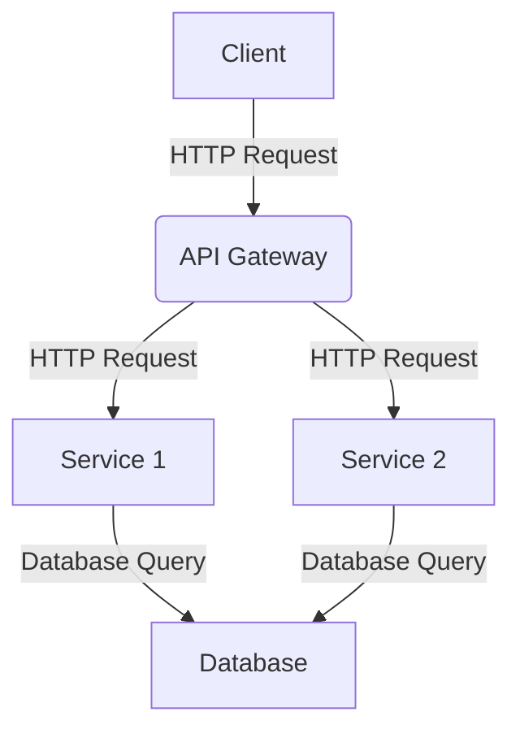

# 🤖 DEV ChatGPT Prompts

This repository contains a list of powerful ChatGPT prompts that can help you get the creative juices flowing.

## Table of Contents

  - [Modernize and add best practices](#modernize-and-add-best-practices)
  - [Review your code for logical errors and security concerns](#review-your-code-for-logical-errors-and-security-concerns)
  - [Validate the recommendations (reflection)](#validate-the-recommendations-reflection)
  - [Write the Code](#write-the-code)
  - [Create Tests](#create-tests)
  - [Re-write Prompt](#re-write-prompt)
  - [Adding Documentation](#adding-documentation)
  - [Write your terms and conditions](#write-your-terms-and-conditions)
  - [Produce cheat sheets](#produce-cheat-sheets)
  - [Generate Readme Files](#generate-readme-files)
  - [Write detailed blogs](#write-detailed-blogs)
  - [Explain Code](#explain-code)
  - [Architecture Diagram (Mermaid)](#architecture-diagram-mermaid)
  - [Entity Relationship Diagram (Mermaid)](#entity-relationship-diagram-mermaid)
  - [Refactor Code](#refactor-code)
  - [Modernizing Old Code](#modernizing-old-code)
  - [Code into Multiple Methods](#code-into-multiple-methods)
  - [Better Performance](#better-performance)
  - [Adding a Parameter to a Function](#adding-a-parameter-to-a-function)
  - [Adding Coding Best Practices or Principles](#adding-coding-best-practices-or-principles)
  - [Follow coding style guidelines](#follow-coding-style-guidelines)
  - [Detecting and Fixing Errors](#detecting-and-fixing-errors)
  - [Debug a React component](#debug-a-react-component)
  - [Create Unit Tests](#create-unit-tests)
  - [Transpiling Code](#transpiling-code)
  - [Responsive Design](#responsive-design)
  - [Internationalization](#internationalization)
  - [Add comments to code](#add-comments-to-code)
  - [Create Functions](#create-functions)
  - [Generate a Dockerfile](#generate-a-dockerfile)
  - [Write a RegEx](#write-a-regex)
  - [Create a Class](#create-a-class)
  - [Add Functionality](#add-functionality)
  - [Create Boilerplate Code](#create-boilerplate-code)
  - [You are a world-class software engineer](#you-are-a-world-class-software-engineer)
  - [Error Handling](#error-handling)
  - [Suggest Improvements](#suggest-improvements)
  - [Generate Innovative Product Ideas](#generate-innovative-product-ideas)
  - [Develop a Unique Value Proposition](#develop-a-unique-value-proposition)
  - [Master the Art of Storytelling for Marketing](#master-the-art-of-storytelling-for-marketing)
  - [Create a Successful Referral Program](#create-a-successful-referral-program)
  - [Master the Art of Upselling and Cross-selling](#master-the-art-of-upselling-and-cross-selling)
  - [Create a Viral Marketing Campaign](#create-a-viral-marketing-campaign)
  - [Develop a Powerful Elevator Pitch](#develop-a-powerful-elevator-pitch)
  - [Create an Actionable Marketing Plan](#create-an-actionable-marketing-plan)
  - [Leverage Content Marketing for Lead Generation](#leverage-content-marketing-for-lead-generation)
  - [Explain Code or Concept](#explain-code-or-concept)
  - [Syntax Check](#syntax-check)
  - [Bug Fixing Assistance](#bug-fixing-assistance)
  - [Best Practices Guidance](#best-practices-guidance)
  - [Code Optimization Request](#code-optimization-request)
  - [Code Generation](#code-generation)
  - [Code Conversion Assistance](#code-conversion-assistance)
  - [Code Execution as Interpreter](#code-execution-as-interpreter)
  - [Web Design Consultation Request](#web-design-consultation-request)
  - [Framework Recommendation Request](#framework-recommendation-request)
  - [Code Execution as Interpreter](#code-execution-as-interpreter)
  - [Dataset Generation Request](#dataset-generation-request)
  - [Web Scraping Assistance](#web-scraping-assistance)
  - [Scalability Advice Request](#scalability-advice-request)
  - [Deployment Strategy Recommendations](#deployment-strategy-recommendations)

### Modernize and add best practices

**Prompt:**

```
Review the following code and re-write it to modern es6 programming standards and formatting:

[insert code here]
```

### Review your code for logical errors and security concerns

**Prompt:**

```
Review your provided code 'tempFunction' for any logical or security concerns and provide a list of recommendations.
```

### Validate the recommendations (reflexion)

**Prompt:**

```
Review your above recommendations. Tell me why you were wrong and if any recommendations were overlooked or incorrectly added?
```

### Write the Code

**Prompt:**

```
Re-write the 'tempFunction' function based off your review and recommendations.
```

### Create Tests

**Prompt:**

```
Create two [ define technology ] tests for the above 'tempFunction' function. One that is expected to pass and one that is expected to fail.
```

### Re-write Prompt

**Prompt:**

```
[your prompt]

Re-write the above text to be more verbose and include a lot of superfluous description about each thing, use very painting language.
```

### Adding Documentation

**Prompt:**

```
I don't know how to code, but I want to understand how this works. Explain the following code to me in a way that a non-technical person can understand. Always use Markdown with nice formatting to make it easier to follow. Organize it by sections with headers. Include references to the code as markdown code blocks in each section. The code:

[insert code here]
```

**Prompt:**

```
Please add comprehensive documentation for [file or module name], including clear and concise explanations of its purpose, design, and implementation. Consider including examples of how to use the module, as well as any relevant diagrams or flow charts to help illustrate its workings. Ensure that the documentation is easily accessible to other developers and is updated as the module evolves. Consider using documentation tools such as inline comments, markdown files, or a documentation generator to simplify the process.

[insert code here]
```

### Write your terms and conditions

**Prompt:**

```
Create terms and services for my website about an [AI tool] called [name].
```

### Produce cheat sheets

**Prompt:**

```
Write a cheat sheet for [markdown formatting].
```

### Generate Readme Files

**Prompt:**

```
Generate documentation for the code below. You should include detailed instructions to allow a developer to run it on a local machine, explain what the code does, and list vulnerabilities that exist in this code.

[enter code]
```

### Write detailed blogs

**Prompt:**

```
Write a detailed blog on How to build a [COVID tracker] using React with proper structuring of code.
```

### Explain Code

**Prompt:**

```
Context: I'm starting a new position as backend developer and I have to start to understand how some functions are working
Technologies: [INSERT YOUR TECHNOLOGIES HERE]
You have to: explain me the code line by line

[INSERT YOUR CODE HERE]
```

### Architecture Diagram (Mermaid)

**Prompt:**

```
Write the Mermaid code for an architecture diagram for this solution [DESCRIBE SOLUTION]
```

Example:



### Entity Relationship Diagram (Mermaid)

**Prompt:**

```
Write the Mermaid code for an entity relationship diagram for these classes [INSERT CLASSES]
```

### Refactor Code

**Prompt:**

```
I have a piece of code and I need you do a refactor of it:

[INSERT YOUR CODE HERE]
```

### Modernizing Old Code

**Prompt:**

```
Refactor the following code to modern es6 programming standards:

[INSERT YOUR CODE HERE]
```

### Code in to Multiple Methods

**Prompt:**

```
Refactor the following code into multiple methods to improve readability and maintainability:

[INSERT YOUR CODE HERE]
```

### Better Performance

**Prompt:**

```
Refactor the following code to improve performance:

[INSERT YOUR CODE HERE]
```

### Adding a Parameter to a Function

**Prompt:**

```
Add a parameter to this function to do [FUNCTIONALITY]

[INSERT YOUR CODE HERE]
```

### Adding Coding Best Practices or Principles

**Prompt:**

```
Rewrite the code below following the Google style guidelines for javascript.

[INSERT YOUR CODE HERE]
```

### Follow coding style guidelines

**Prompt:**

```
Review the following code and refactor it to make it more DRY and adopt the SOLID programming principles.

[INSERT YOUR CODE HERE]
```

### Detecting and Fixing Errors

**Prompt 1#:**

```
Review this code for errors and refactor to fix any issues:

[INSERT YOUR CODE HERE]
```

**Prompt 2#:**

```
I'm developing software in [INSERT YOUR TECHNOLOGIES HERE] and I need you help me to find and
fix all the errors in my code, following the best practices. I'll provide you my code
and you'll give me the code with all the corrections explained line by line
```

**Prompt 3#:**

```
I wrote this code [CODE] I got this error [ERROR] How can I fix it? or What does this error mean?
```

### Debug a React component

**Prompt:**

```
Please find and fix the bug in the [component name] component that is causing [describe the issue].

[INSERT YOUR CODE HERE]
```

### Create Unit Tests

**Prompt 1#:**

```
Please write unit tests for [file or module name] to ensure its proper functioning

[insert code here]
```

**Prompt 2#:**

```
Create 2 unit tests for the provided code. One for a successful condition and one for failure.
```

### Transpiling Code

**Prompt:**

```
Rewrite the following code in Rust:

[INSERT YOUR CODE HERE]
```

### Responsive Design

**Prompt:**

```
RPlease implement responsive design for the [component name] component to ensure that it looks and functions correctly on different screen sizes and devices. Consider using [responsive design technique or library] to achieve this.

[insert code here]
```

### Internationalization

**Prompt:**

```
Please implement internationalization for the [component name] component to ensure that it can be used by users in multiple languages. Consider using [internationalization library or technique] to achieve this.
```
### Add comments to code

**Prompt:**

```
Add comments to the following code:

[INSERT YOUR CODE HERE]
```

### Create Functions

**Prompt:**

```
Context: I'm creating a software to manage projects

Technologies: Go, PostgreSQL

Description: It's a function that let me find users by its email or username.

You have to: create the function for me
```

Also you can add in the description what you expect to receive from your function. If you already have an structure for the User, specify it, for example:

**Prompt:**

```
Context: I'm creating a software to manage projects

Technologies: Go, PostgreSQL

Description: It's a function that let me find users by its email or username and returns the structure type "Member"

You have to: create the function for me
```

### Generate a Dockerfile

**Prompt:**

```
Write a Dockerfile for:

[FRAMEWORK]
```

### Write a RegEx

**Prompt:**

```
Write a regular expression that matches / Write a RegEx pattern for:

[REQUEST]
```

### Create a Class

**Prompt:**

```
Create a [PLATFORM] class from this JSON object

[JSON]
```

### Add Functionality

**Prompt:**

```
I need a piece of code in [INSERT YOUR TECHNOLOGIES HERE] to implement [real-time communication]
```

### Create Boilerplate Code

**Prompt:**

```
Write me a boilerplate Node.js function that will take a variable of type User, validate that the user has the right permissions, fetch an array of item type Posts from a postgres database and return them. Leave comments for business logic.
```

### You are a world class software engineer

**Prompt:**

```
You are a world class software engineer.

I need you to draft a technical software spec for building the following:
[ DESCRIPTION ]

Think through how you would build it step by step.

Then, respond with the complete spec as a well-organized markdown file.

I will then reply with "build," and you will proceed to implement the exact spec, writing all of the code needed. I will periodically interject with "continue" to >prompt you to keep going. Continue until complete.
```

### Error Hendling

**Prompt:**

```
How can I improve the error handling in my [LANGUAGE] code? [CODE]
```

### Suggest Improvements

**Prompt:**

```
I'm working on a [LANGUAGE] project and I need you to review my code and suggest improvements. [CODE]
```

### Generate innovative product ideas

**Prompt:**

```
Brainstorm creative and unique product ideas for [insert industry or market]. 

Focus on solving customer pain points and providing exceptional value.
```

### Develop a unique value proposition

**Prompt:**

```
Help me articulate a unique value proposition for my [insert product or service].

Explain how this proposition differentiates my offering and appeals to my target audience.
```

### Master the art of storytelling for marketing

**Prompt:**

```
Teach me storytelling techniques for creating compelling marketing content to promote [insert product or service].
```

### Create a successful referral program

**Prompt:**

```
Design a referral program for [insert business] that incentivizes customers to share and recommend our products or services.
```

### Master the art of upselling and cross-selling

**Prompt:**

```
Teach me effective upselling and cross-selling techniques to increase revenue and customer satisfaction in [insert business context].
```

### Create a viral marketing campaign

**Prompt:**

```
Design a creative and attention-grabbing marketing campaign for [insert product or service] with the potential to go viral.
```

### Develop a powerful elevator pitch

**Prompt:**

```
[Insert a brief description of your product, service, or company].

Help me create a concise and compelling elevator pitch that will effectively communicate the value of my offering.
```

### Create an actionable marketing plan

**Prompt:**

```
Develop a marketing plan for [insert product or service]. 

Include objectives, target audience, marketing channels, and tactics for reaching my desired audience and driving sales.
```

### Leverage content marketing for lead generation

**Prompt:**

```
Develop a content marketing strategy for [insert business] to attract, engage, and convert leads into customers.
```

### Explain Code or Concept

**Prompt:**

```
Explain how the {concept or function} works in {programming language}.
```

### Syntax Check

**Prompt:**

```
What is the correct syntax for a {statement or function} in {programming language}?
```

### Bug Fixing Assistance

**Prompt:**

```
How do I fix the following {programming language} code which {explain the functioning}? {code snippet}
```

### Best Practices Guidance

**Prompt:**

```
Show me best practices for writing {concept or function} in {programming language}.
```

### Code Optimization Request

**Prompt:**

```
Optimize the following {programming language} code which {explain the functioning}: {code snippet}
```

### Code Generation

**Prompt:**

```
Write a program/function to {explain functionality} in {programming language}.
```

### Code Conversion Assistance

**Prompt:**

```
Convert the following {programming language 1} code to {programming language 2}: {code snippet}
```

### Code Execution as Interpreter

**Prompt:**

```
I want you to act like a {programming language} interpreter/compiler. I will give you {programming language} code, and you will execute it. Do not provide any explanations. Do not respond with anything except the output of the code.
```

### Web Design Consultation Request

**Prompt:**

```
I want you to act as a web design consultant. I will provide you with details related to an organization needing assistance in designing or redeveloping its website, and your role is to suggest the most suitable interface and features that can enhance user experience while also meeting the company’s business goals.
```

### Framework Recommendation Request

**Prompt:**

```
Can you recommend a suitable front-end framework/library for my website? I’m making {type of website}.
```

### **Code Execution as Interpreter**

**Prompt:**

```
Regenerate the code snippet below, but please include comments on each line of code {enter code}.
```

### Dataset Generation Request

**Prompt:**

```
Generate {type of dataset} dataset containing {n} data points regarding {service or product} with fields including {fields}.
```

### Web Scraping Assistance

**Prompt:**

```
Web scrape data from {url} using Python and Beautifulsoup.
```

### Scalability Advice Request

**Prompt:**

```
I’m working on a software project and need advice on ensuring scalability. Details: [Briefly describe the project, current usage and future growth, and technology stack].
```

### Deployment Strategy Recommendations

**Prompt:**

```
What are the best deployment strategies for this software project? {explain the project}
```
